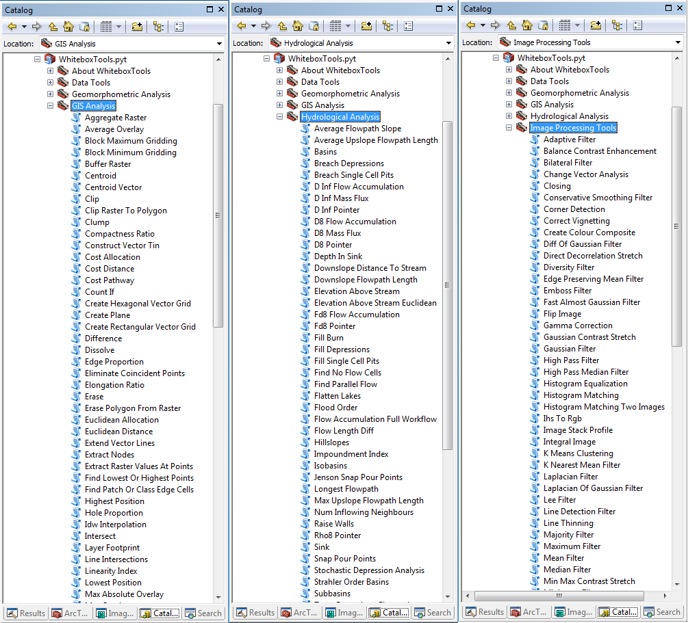
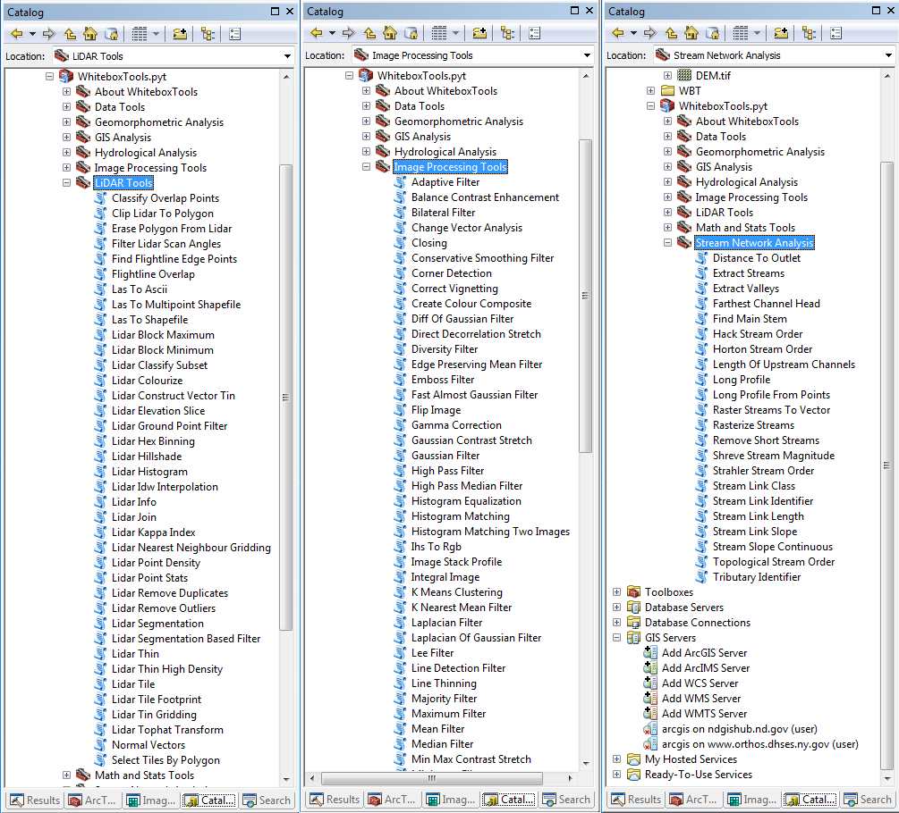

# WhiteboxTools-ArcGIS

ArcGIS Python Toolbox for WhiteboxTools.

* Authors: Dr. John Lindsay (<http://www.uoguelph.ca/~hydrogeo/index.html>)
* Contributors: Dr. Qiusheng Wu (<https://wetlands.io>)
* GitHub repo: <https://github.com/giswqs/WhiteboxTools-ArcGIS>
* WhiteboxTools: <https://github.com/jblindsay/whitebox-tools>
* User Manual: <https://jblindsay.github.io/wbt_book>
* Free software: [MIT license](https://opensource.org/licenses/MIT)

WhiteboxTools-ArcGIS Toolbox Preview. **Work in progress! Not ready for use yet.**

